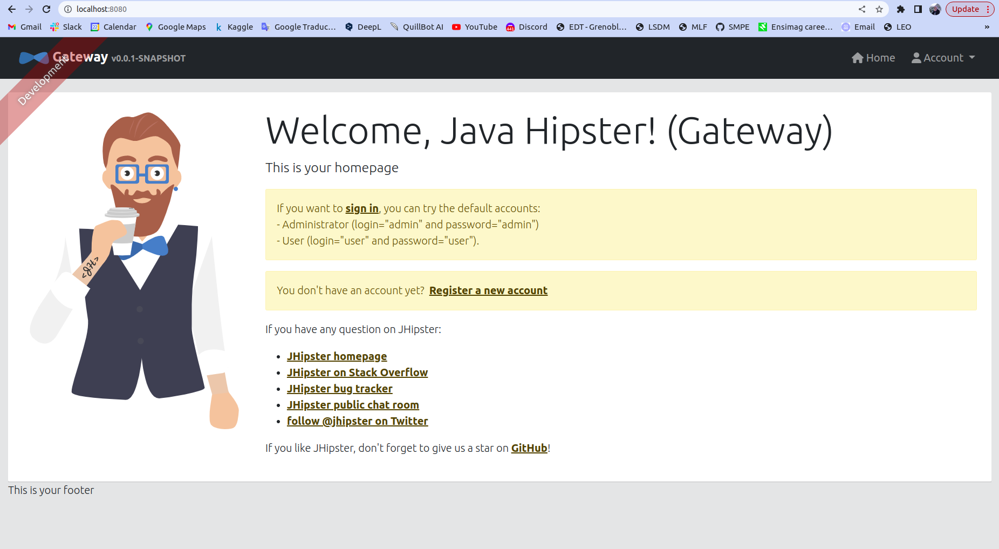
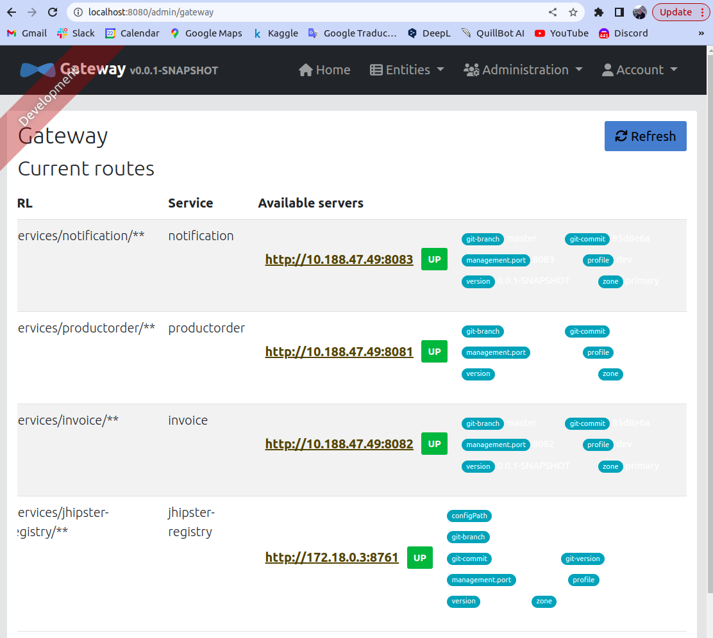
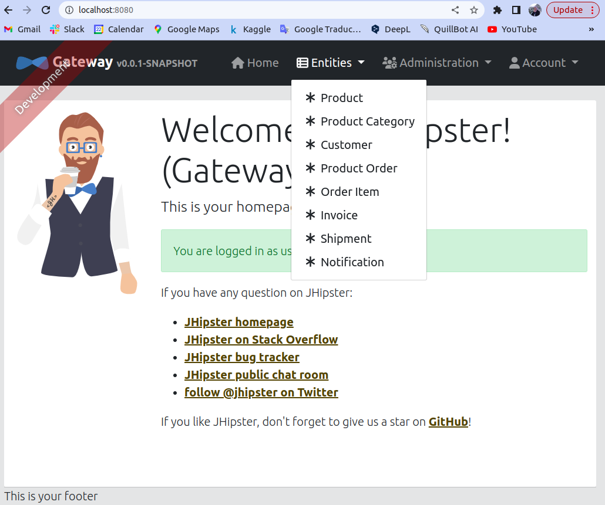
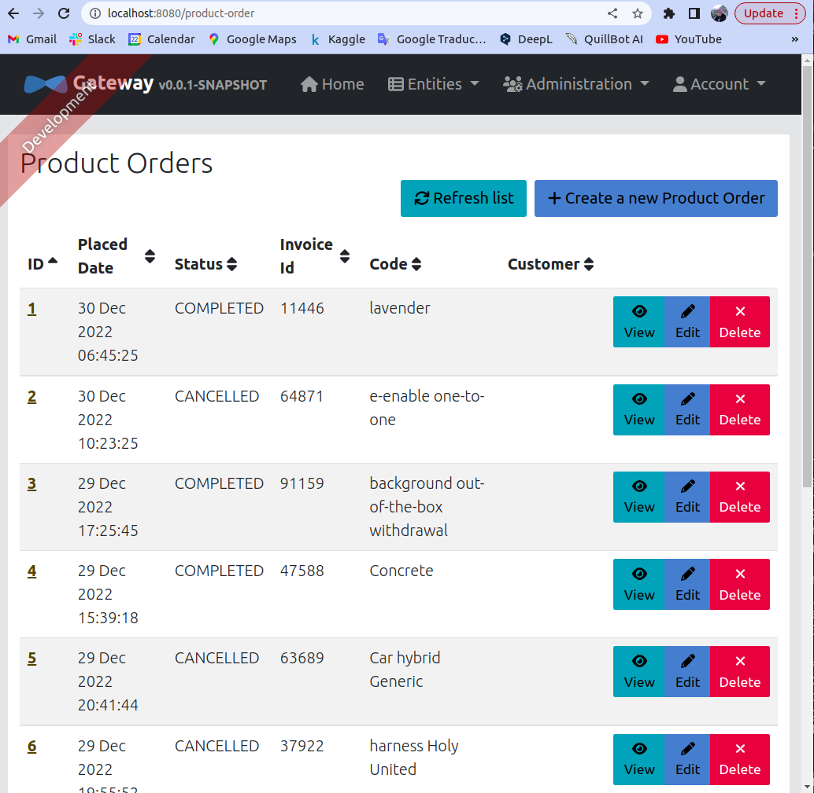
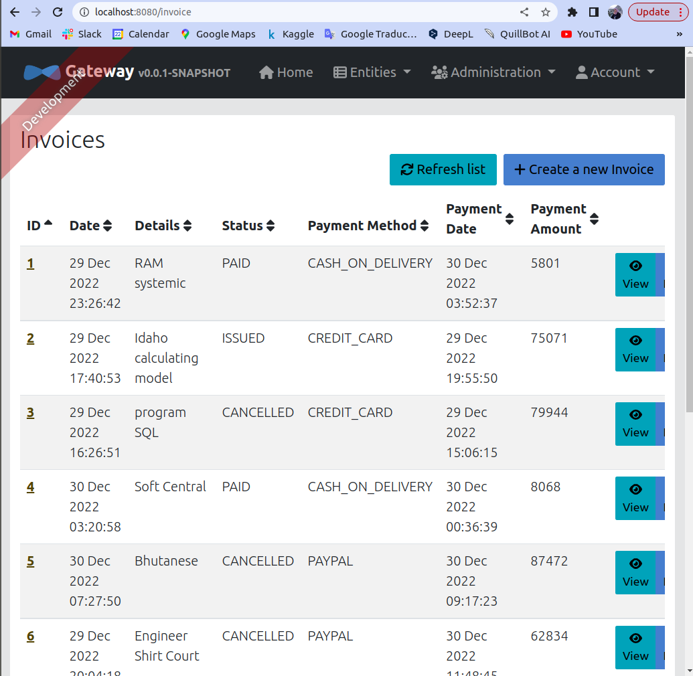
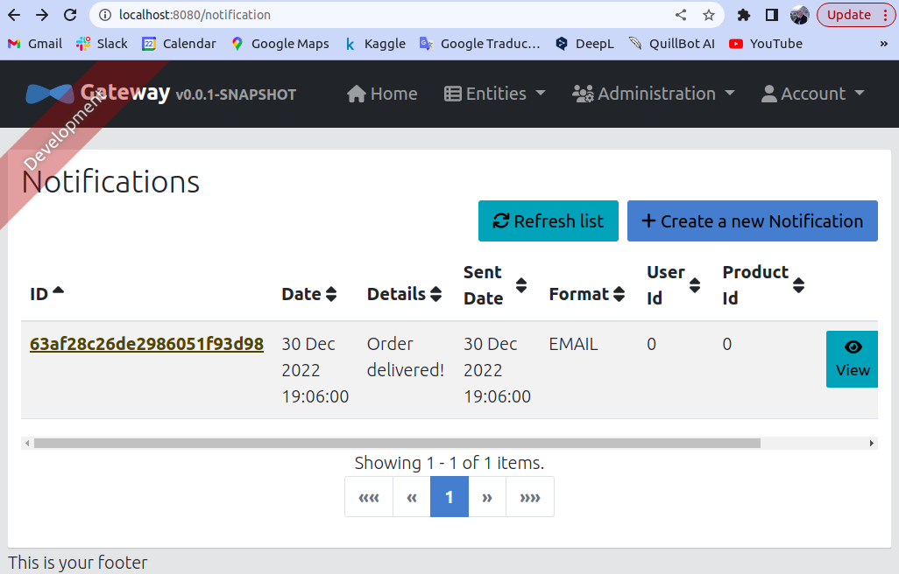
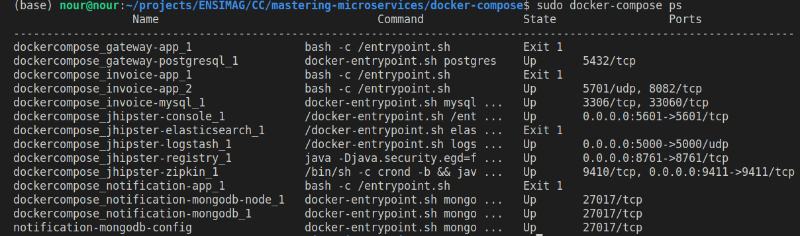
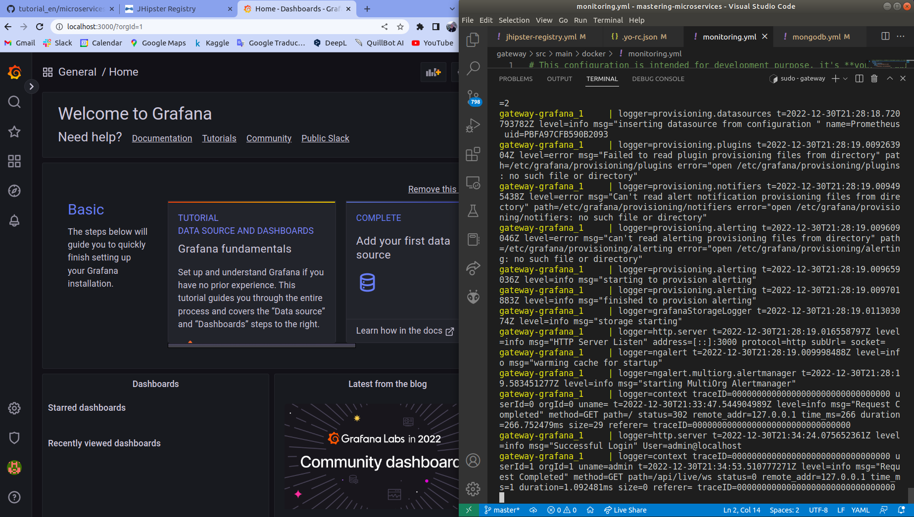

# microservices-jHipster
## 1. Generate the microservices architecture
### 1.1.  Generate Gateway application and microservices applications

### 1.2.  Launch microservices, jHipster registry, and gateway

### 1.3.  Browse the application

### 1.4.  Refactor the application

### 1.5.  Build Docker images

### 1.6.  Monitor microservices with Prometheus & Grafana

