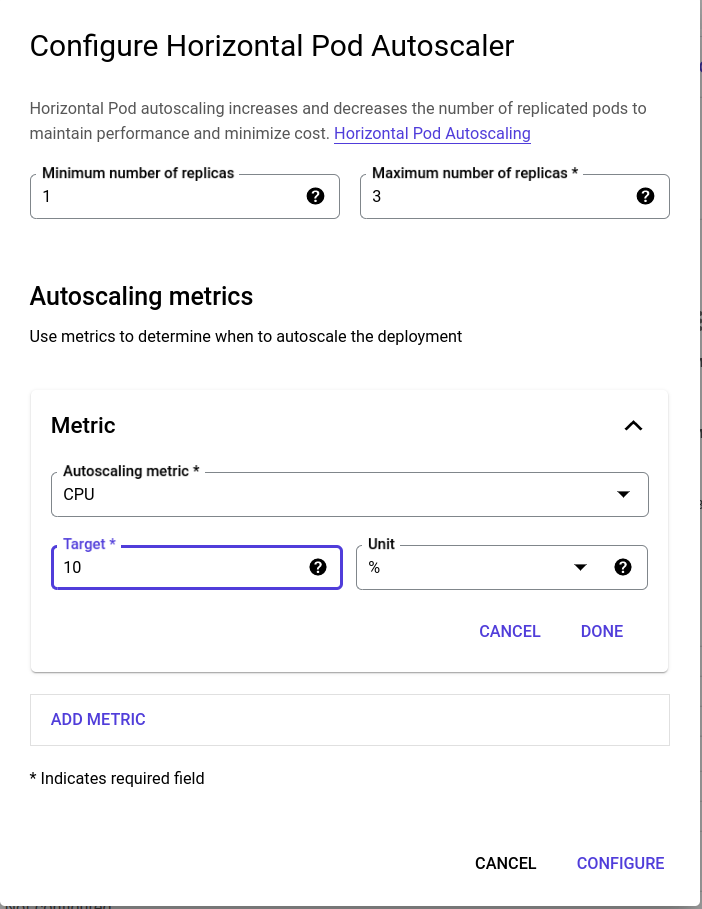

# 3.  Enabling scalability on GCP for one microservice
We enabled scalability or autoscaling (horizontal in this case) for the gateway microservice, such that if its CPU usage exceeds 10%, horizontal scaling will be enabled which leads to the creation of at most 3 replicas as shown in the figure below.

