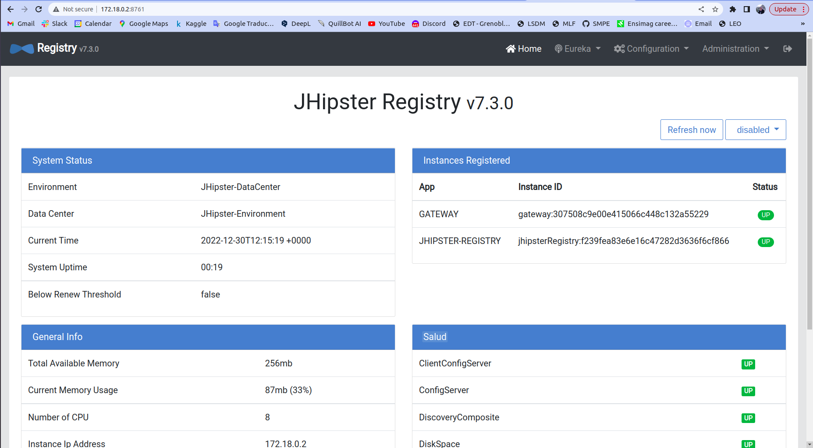

## 1. Generating the microservices architecture
### 1.1.  Generate Gateway application and microservices applications

### 1.2.  Launch microservices, jHipster registry, and gateway
The following screenshots confirm the successful creation of the microservices and the jhispter registry.

We can see through the gateway that all services are up and running.

### 1.3.  Refactor the application
After having added the entities to the microservices and launching them again, we can notice them appearing in the gateway. 

Here are the outputs of browsing some examples in the dropdown shown above.

### 1.4  Build Docker images
Docker images have been successfully created.

### 1.5  Monitor microservices with Prometheus & Grafana
Grafana, the visualization tool, is now accessible on port 3000. It's used to display the metrics collected by Promotheus.

