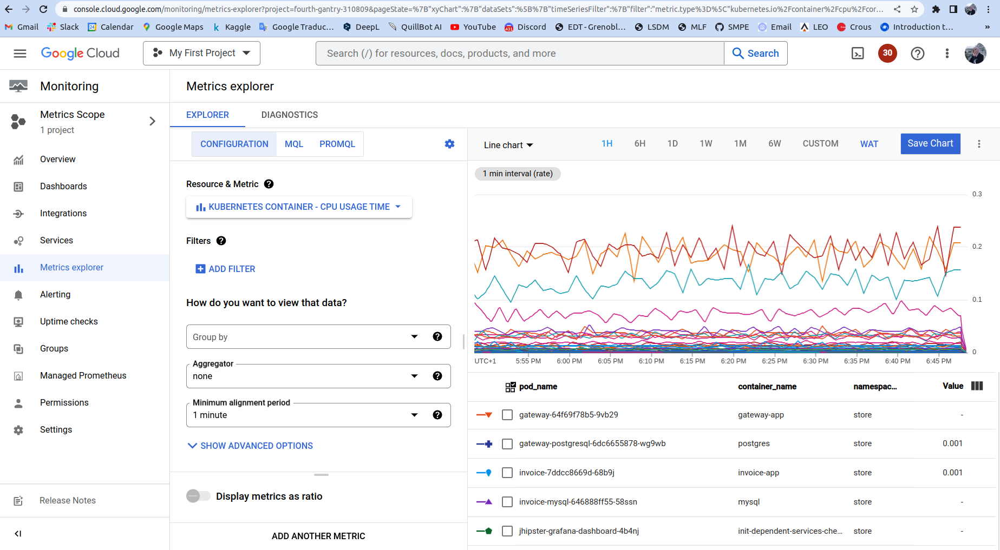
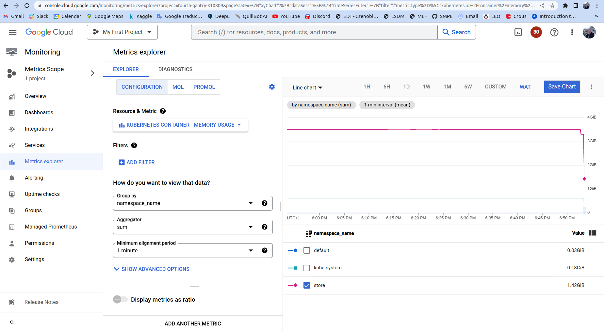

# 4.  Monitoring dashboard
We first tried to use Promeheus and Grafana for monitoring but we faced a lot of issues, including:
  - CRDs are not defined: for that we have defined some CRDs which are necessary to Prometheus & Grafana deployments. 
  - Service account couldn't list "probes" in API group: to fix that, we added the ClusterRole in Prometheurs-cr.yml.
  - File "/etc/prometheus/prometheus.env.yml" not found: we think that the jhipster-prometheus and jhipster-operator weren't running on the same pod, so jhipster-operator container was trying to access a volume that should be shared with jhipster-prometheus. We were able to log into Grafana using jhipster/jhipster for the authentication, but no data were shown on the dashboard, and this is due to the fact that Prometheus has never started.

Therefore, we are showing in the two figures below some monitoring metrics provided by GCP monitoring API. The first one displays the CPU usage by different pods belonging to the "store" namespace.

The second figure aggregates the memory usage per namespace, and we're showing here the one of namespace "store" which is our application. Metrics explorer of Google Cloud Monitoring API provides a large number of metrics categories, with nice readable dashboards.

